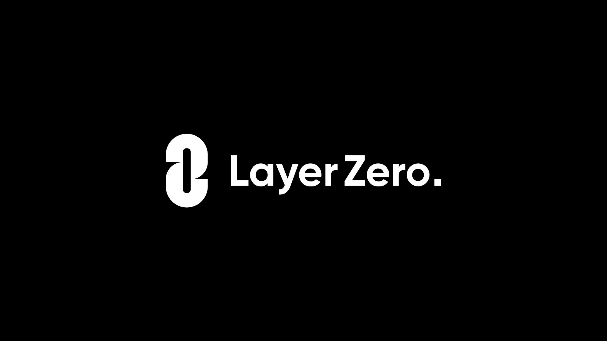

<div align="center">
    
</div>

---

# LayerZero Omnichain Contract Examples

- Formal audit(s) (May 21, 2022) can be found in /audit

### Install & Run tests

```shell
yarn install
npx hardhat test
```

> The examples below use two chains, however you could substitute any LayerZero supported chain!

# OmnichainFungibleToken (OFT)

## About OFTV2

```shell
NOTE: the OFTV2 uses uint64 to encode value transfer for compatability of aptos and solana.

The deployer is expected to set a lower decimal points like 6 or 8.

If the decimal point is 18, then uint64 can only represent approximately 18 tokens (uint64.max ~= 18 * 10^18).
```

## Deploy Setup

1. Add a .env file (to the root project directory) with your MNEMONIC="" and fund your wallet in order to deploy!
2. Follow any of the tutorials below

## OFTV2.sol - an omnichain ERC20

> WARNING: **You must perform the setTrustedRemote() (step 2).**

1. Deploy two contracts:

```angular2html
npx hardhat --network optimism-goerli deploy --tags ExampleOFTV2
npx hardhat --network base-goerli deploy --tags ExampleOFTV2
```

2. Set the "trusted remotes" (ie: your contracts) so each of them can receive messages from one another, and `only` one another.

```angular2html
npx hardhat --network optimism-goerli setTrustedRemote --target-network base-goerli --contract ExampleOFTV2
npx hardhat --network base-goerli setTrustedRemote --target-network optimism-goerli --contract ExampleOFTV2
```

3. Send tokens from optimism-goerli to base-goerli

```angular2html
npx hardhat --network optimism-goerli oftv2Send --target-network base-goerli --qty 42 --contract ExampleOFTV2
```

Pro-tip: Check the ERC20 transactions tab of the destination chain block explorer and await your tokens!

## Most recently tested with node version `16.13.1`
